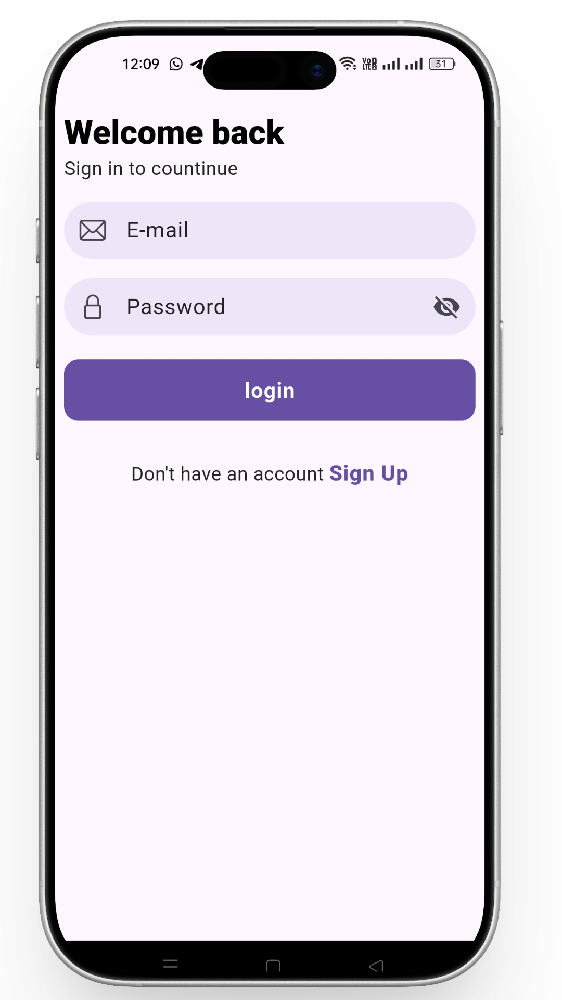

# 💬 Flutter Chat App

Mobile chat application built with `Flutter` to provide **real-time messaging**.  
Supports **user authentication**, **contacts access**, and **responsive UI**. Designed with **Bloc + MVVM** architecture for scalability and maintainability.

---

## 📌 Table of Contents
- [Screenshots](#-screenshots)  
- [Features](#-features)  
- [Tech Stack](#-tech-stack)  
- [Architecture](#-architecture)  
- [State Management](#-state-management)  
- [Firebase Realtime Database](#-firebase-realtime-database)  
- [Authentication](#-authentication)  
- [Lifecycle & Permissions](#-lifecycle--permissions)  
- [Performance](#-performance)  
- [License](#-license)  

---

## 📸 Screenshots
*Add your screenshots here:*

<table>
<tr>
  <td></td>
  <td></td>
  <td></td>
</tr>
</table>

---

## 🚀 Features
- 💬 **Real-time Messaging** – Send & receive messages instantly  
- 🔐 **Authentication** – Login/Signup using Firebase Auth  
- 📇 **Contacts Access** – Sync and find registered users from phone contacts  
- 🏗 **Clean Architecture** – Bloc + MVVM for scalable code   
- 🔄 **Lifecycle Management** – Proper handling of app foreground/background state  
- ⚡ **Optimized Performance** – Smooth and responsive UI  
- 📦 **Offline Support** – Cached messages with Firebase  

---

## 🛠 Tech Stack
- **Flutter** (Frontend)  
- **Dart** (Programming Language)  
- **Firebase Realtime Database**  
- **Firebase Authentication**  
- **Bloc + MVVM** (State Management & Architecture)  
- **Lifecycle & Permissions**  
- **Contacts Access**  

---

## 🏛 Architecture
This project uses **Bloc + MVVM** architecture:  
- Separation of concerns  
- Testable modules  
- Scalable and maintainable  
- Reactive state management with Bloc  

---

## 🧠 State Management
- **Bloc** for UI & business logic  
- **MVVM** pattern for separation of views & models  
- Handles **loading, error, and real-time updates**  

---

## 🔌 Firebase Realtime Database
- Store and sync messages in real-time  
- Handle **user presence / online status**  
- Efficient **read/write operations**  

---

## 🔐 Authentication
- Sign up & login using **Firebase Auth**  
- Secure password management  
- Supports multiple devices  

---

## 🔄 Lifecycle & Permissions
- Proper handling of **app lifecycle** (foreground/background)  
- Request access to **phone contacts** securely  
- Handle runtime permissions gracefully  

---

## ⚡ Performance Boosters
- Efficient **message caching**  
- Smooth scrolling for chat lists  
- Optimized for **low latency messaging**  
- Minimal memory usage  

---

## 📄 License
This project is licensed under the MIT License - see the LICENSE file for details.  
